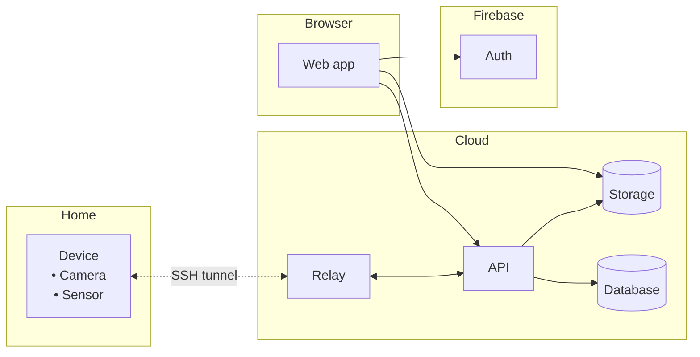

# moja

Remote video streaming and sensor data.

<p align="center">

</p>

## Architecture



- **Pi** (`pi/`): FastAPI server on each Raspberry Pi that serves a live HLS stream from the camera and readings from the sensor. An `autossh` reverse tunnel exposes it on the relay host, and a cron job registers the device every minute.
- **Relay** (`relay/`): Small service in the cloud that terminates the SSH tunnels and forwards device registrations to the API.
- **API** (`recorder/`): Keeps track of devices and users in Postgres, proxies requests to devices, records clips and sensor readings, and stores recordings in object storage.
- **Web** (`web/`): SvelteKit app where users sign in with Firebase and watch live streams, recordings and sensor graphs.
- **Deployment** (`deployment/`): Ansible playbooks, run from GitHub Actions, that deploy the relay and the Pi services.

## Development

Run containers with

```
GOOGLE_ID_TOKEN=$(gcloud auth print-identity-token) docker compose up
```

then go to `http://localhost:8004`